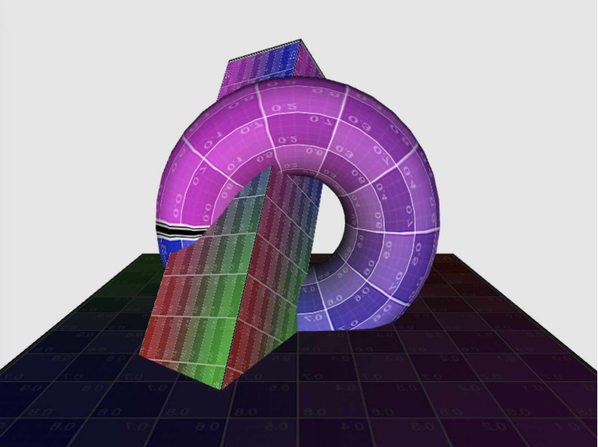

# WebGl from scratch

This repo is an example of how a WebGL scene can be rendered from scratch, without the use of frameworks e.g. the fantastic three.js.

It includes the glMatrix library for easier Vector and Matrix computation.

Run a web server and you should see:

